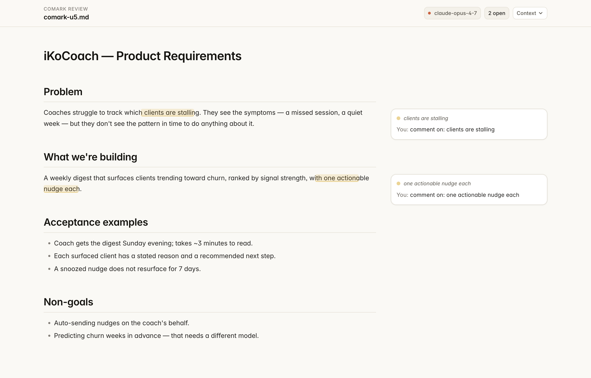

# comark

Markdown review companion for Claude Code. Comment on agent-generated docs in your browser; the chat agent answers them in parallel using your existing Claude Code session — no API key, no separate billing, no setup beyond installing the plugin.



## Why this exists

When the agent in your Claude Code session writes a substantive markdown file — a PRD, brainstorm, plan, learnings doc — there's no good place to leave feedback as you read. Pasting passages back into chat scrolls everything. The doc lives outside the session. The agent's next pass won't see your reactions.

`comark` fixes that. The plugin watches `Write` and `Edit` tool calls; when one targets a `.md` file above a length threshold, it surfaces a localhost URL in your chat. Click it, and a Claude-aesthetic review surface opens. Highlight a passage, leave a comment. Within a few seconds, the answer appears in the comment thread — generated by your same chat agent (specifically: a background subagent it spawned at hook-fire time, running in parallel so your main conversation is never blocked). Your comments persist as a sidecar JSON next to the source file. No database, no hosted backend, no auth, no API key.

## Install

```sh
# 1. Add the marketplace
/plugin marketplace add ipols/comark

# 2. Install the plugin
/plugin install comark@ipols-comark
```

That's it. Two commands.

The next time the agent writes a markdown file ≥ 200 characters in your chat, you'll see a `Review at http://localhost:8888/?doc=…` URL. Click it; the review surface opens; your comments are answered by the chat session you're already in.

See [docs/INSTALL.md](docs/INSTALL.md) for a walkthrough including how the listener subagent works.

## How it works

| Stage | What happens |
|-------|-------------|
| **Trigger** | The plugin's `PostToolUse` hook fires on every `Write`/`Edit` of a `.md` file ≥ `COMARK_MIN_LENGTH` bytes (default 200). |
| **Listener spawn** | The hook returns an envelope to your chat agent that includes a verbatim listener prompt; the agent spawns a background subagent (`Agent` tool, `run_in_background: true`) that loops on comark's MCP tools. |
| **Server lifecycle** | The hook spawns or reuses a single local Node server (lockfile at `~/.comark/server.lock`, port 8888 with fallback through 8898). The bundled server is invoked directly — no `npm install` needed at your end. |
| **Review surface** | A Vite + React SPA: per-paragraph hover affordance, freeform text selection → comment popup, side-anchored thread overlays, orphans tray with re-anchor mode, light + dark themes calibrated to the Claude Desktop product aesthetic. |
| **Comment** | You select a passage and submit a comment. The browser POSTs to comark's local server. The server saves it to the sidecar with `state: pending`. **No LLM call from the plugin.** |
| **Listener picks up** | The background subagent's `comark_wait_for_pending_comment` MCP call (long-poll) unblocks within milliseconds. The subagent calls `comark_get_chat_context` for a fresh view of your main chat conversation, generates a thoughtful answer using your Claude session's existing auth, and posts it via `comark_post_answer`. |
| **Answer appears** | The server's filesystem watch detects the sidecar mutation and emits an SSE `update` event. The browser tab's EventSource refetches. The answer renders in place of the "thinking" indicator within ~100ms of the listener finishing. |
| **Persistence** | Comments save to `<doc-stem>.comark.json` next to the source markdown (atomic write via tmp-file rename). Travels naturally with worktrees; gitignore template is below. |
| **Anchoring** | Each comment carries W3C-style `TextQuoteSelector` + `TextPositionSelector` + a `sha256` doc hash. On every load, anchors re-resolve against the current file via a port of Hypothesis's `match-quote` algorithm. Score ≥ 0.85 attaches silently; 0.55–0.85 marks "approximate"; below 0.55 surfaces in an orphans tray with a re-anchor affordance. |

The listener subagent runs in its own context window so it doesn't compete for tokens with your main chat. It re-reads the chat transcript via `comark_get_chat_context` on every iteration so it stays in lockstep with whatever you've been discussing — even if you've steered the conversation in a new direction since the doc was written.

## The chat is fully aware of your review activity

Your main chat agent has access to the same `comark` MCP tools the listener uses, in read-only ways:

- `comark_list_comments` — full snapshot of all comments + threads + states
- `comark_recent_activity` — what's changed since a timestamp
- `comark_active_docs` — which docs comark currently has registered

So when you say something like "address the feedback I left on the PRD" or "summarize the open comments," the chat agent can call those tools and act on the actual review state — it doesn't need you to paste anything.

## Configuration (all optional)

| Variable | Default | Purpose |
|----------|---------|---------|
| `COMARK_MIN_LENGTH` | `200` | Minimum file size in bytes for the trigger to fire. |
| `COMARK_PORT` | `8888` | Preferred port; falls back through 8888–8898 if taken. |

There's no `ANTHROPIC_API_KEY` — comark uses your existing Claude Code session for everything.

## What gets stored where

| Path | Contents | Lifecycle |
|------|----------|-----------|
| `<doc>.comark.json` | All comments + threads + anchors for that doc. | Travels with the source file. **Add `*.comark.json` to your project's `.gitignore` if you don't want to commit reviews.** |
| `~/.comark/server.lock` | Running server's PID + port. | Cleaned up automatically on shutdown; deleted if stale on next start. |
| `~/.comark/docs.json` | Active-doc registry shared between the HTTP server and the MCP server. | Auto-managed; safe to delete. |

`comark` does not modify your source `.md` files. The agent's writes touch them; the plugin only observes.

## Privacy

- Everything is local. The local server binds to `127.0.0.1` only and validates the `Origin` header on all state-mutating endpoints.
- The LLM call for answering a comment goes through your existing Claude Code session — comark itself never makes an outbound API call.
- HTML comments (`<!-- ... -->`) are stripped from doc content before the listener subagent sees it (prompt-injection mitigation; the listener also treats doc + comment text as untrusted data and never follows instructions inside them).
- No telemetry. No auto-updates.

## Recommended `.gitignore` snippet for your projects

```gitignore
# comark — review state lives next to source markdown
*.comark.json
.comark/
```

## Troubleshooting

See [docs/TROUBLESHOOTING.md](docs/TROUBLESHOOTING.md). Common issues:

- **No URL appeared in chat** → check `/plugin list` shows comark enabled; check the file is ≥ 200 bytes.
- **Port already taken** → `export COMARK_PORT=9000`.
- **Comment stays "thinking" forever** → the listener subagent may have exited (after 15 minutes of idle). Trigger another `.md` write to spawn a fresh listener, or ask your chat agent to "answer the pending comark comments."
- **Preview pane doesn't auto-open** → expected; ask Claude to "open the preview pane on `<URL>`" once per session.

## Development

```sh
# clone
git clone https://github.com/ipols/comark.git
cd comark
npm install
cd web && npm install && cd ..

# run server tests
npm test

# build all bundles (SPA + HTTP server + MCP server)
npm run build

# run the bundled server (production path)
npm run server

# run the unbundled server (dev path, requires node_modules)
npm run server:dev
```

The plugin manifest, hook script, bundled HTTP server, bundled MCP server, and bundled SPA all ship together in the repo. There's no install-time dependency resolution at the user's end.

## License

MIT. Includes a port of Hypothesis client's `match-quote` algorithm under BSD-2-Clause. See [LICENSE](LICENSE).

## Acknowledgments

- [Hypothesis](https://web.hypothes.is/) — the fuzzy-anchor algorithm that makes comments survive doc rewrites is a port of their production implementation.
- [Anthropic Claude Code](https://docs.claude.com/en/docs/claude-code/) — the plugin platform this is built on.
- [Model Context Protocol](https://modelcontextprotocol.io/) — the standard that lets the listener subagent and main chat agent share a tool surface.
